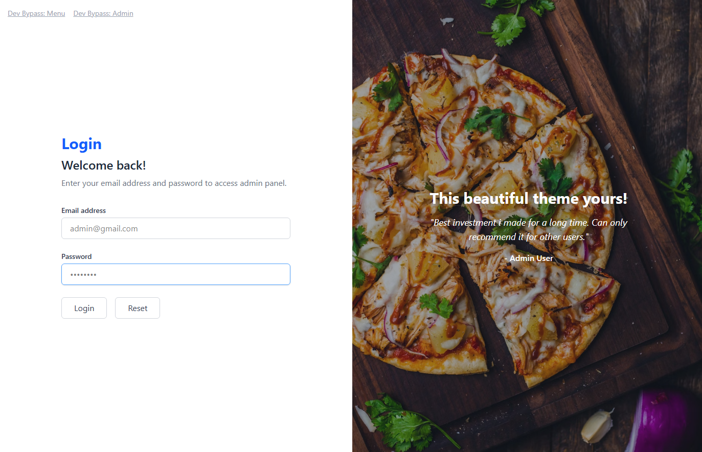
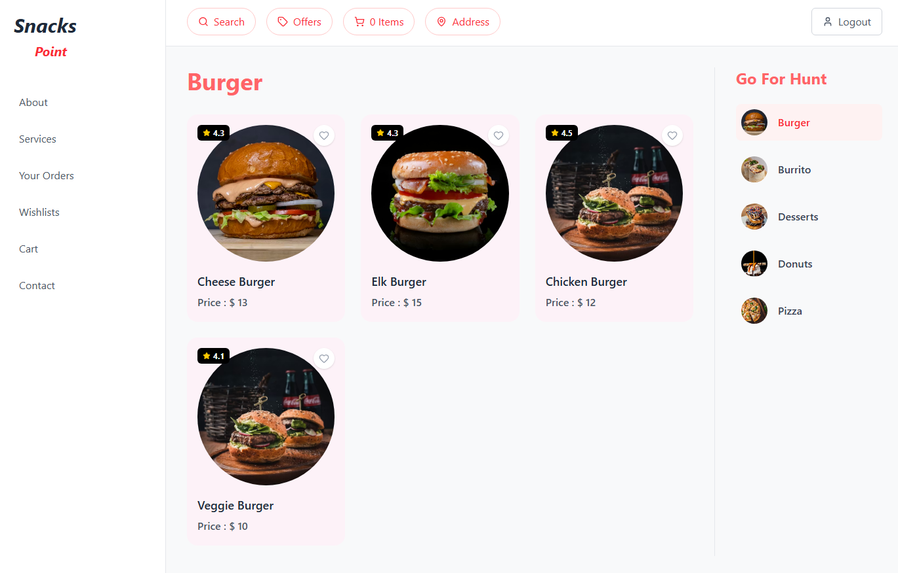
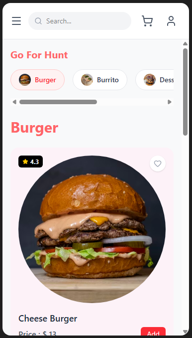
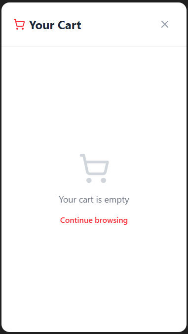
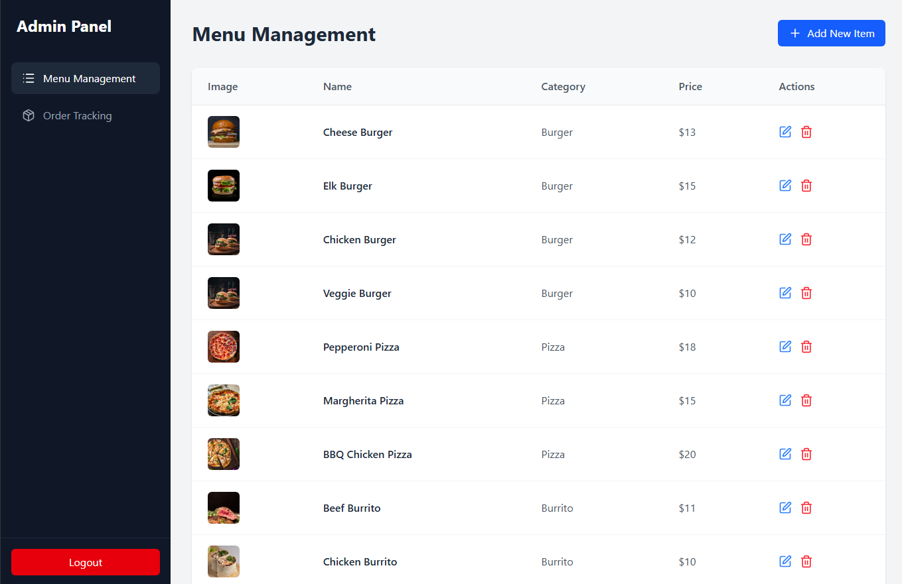

# Online Food Ordering Application

## Objective
To demonstrate the design, development, and deployment of an Online Food Ordering Application for managing restaurant menus, orders, and user interactions. This project focuses on creating a responsive web-based interface for users to browse food items, place orders, and manage profiles, while administrators handle menu updates and order tracking. The objective is to streamline food ordering processes, improve customer experience, and support operational efficiency for restaurants. This implementation aims to enhance user convenience, reduce manual workload, and promote digital transformation in the food service industry.

## Problem Statement and Motivation

**Real-time scenario:**
In the fast-paced digital marketplace, restaurants and food delivery services must meet growing consumer demand for fast, convenient, and contactless food ordering. Manual ordering systems can lead to inefficiencies, order inaccuracies, and customer dissatisfaction. Customers expect seamless online interfaces that allow them to browse menus, place orders, and make payments effortlessly from any device.

**Solution:**
The Online Food Ordering Application streamlines the ordering process by allowing users to browse menus, place orders, and make payments online. It minimizes manual errors, improves order accuracy, and speeds up service. Using HTML, CSS, JavaScript, and modern frameworks (React, Tailwind CSS), the app delivers a responsive, interactive experience that enhances customer satisfaction and operational efficiency.

## Industry Relevance
The following tools are widely being used in the industry to design the frontend of a web application:
1. **Git**: It serves as a version control system, allowing developers to track changes, collaborate on different versions of the codebase, and manage updates without overwriting any part of the project.
2. **HTML**: It is used to structure the content on the web pages, laying out the foundation for text, images, and other multimedia elements in the project.
3. **CSS (Tailwind CSS)**: It is employed to style and layout the web pages designed with HTML. It controls the visual appearance, from fonts and colors to spacing and responsiveness.
4. **JavaScript (React)**: It adds interactivity and dynamic elements to the web pages. It is used for client-side scripting to create responsive, interactive elements for the user interface.

## Tasks Completed

The following steps outline the process of developing and testing this Online Food Ordering Application:

1. **Set up a remote Git repository**: Managed and tracked the development of the frontend using Git.
2. **HTML Layout**: Used semantic HTML (via React JSX) to lay out the structural foundation of the application, including sidebars, navigation bars, and content grids.
3. **CSS Styling**: Applied Tailwind CSS to style the HTML elements, focusing on visual appeal, layout, and mobile/tablet responsiveness.
4. **JavaScript Interactivity**: Used React (JavaScript) to add dynamic features, such as interactive category filtering, adding items to a cart, toggling wishlists, and handling mobile menu toggles.
5. **AJAX/Data Loading**: Implemented state management and mock data loading to simulate fetching menu items and sending data to the server without refreshing the page.

## Output Screenshots

*(Note: When deploying to GitHub, please replace the placeholder links below with actual screenshots of your running application.)*

### 1. Admin Login Page
Used to authenticate users and grant access to the admin panel or user menu.


### 2. User Dashboard / Menu Page (Desktop)
The main interface for users to browse food, filter by category, and add items to their cart.


### 3. User Dashboard / Menu Page (Mobile)
A fully responsive mobile view featuring a centered search bar, a slide-out cart overlay, and a hamburger menu.


### 4. Cart Overlay
An interactive slide-out cart showing selected items, subtotal, delivery fee, and total.


### 5. Admin Dashboard
A dedicated portal for administrators to manage menu items and track active orders.


## How to Run Locally

1. Clone the repository:
   ```bash
   git clone <your-repo-url>
   ```
2. Navigate to the project directory:
   ```bash
   cd online-food-ordering-app
   ```
3. Install dependencies:
   ```bash
   npm install
   ```
4. Start the development server:
   ```bash
   npm run dev
   ```
5. Open your browser and visit `http://localhost:3000` (or the port specified in your terminal).
